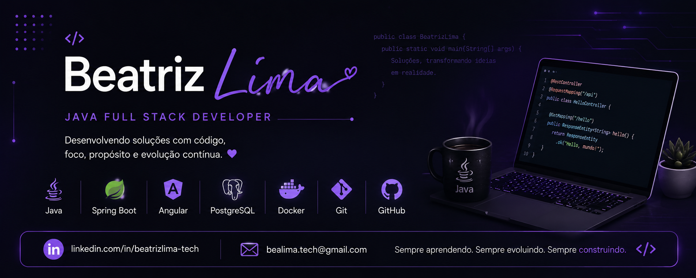

  

<h1 align="center">Beatriz Lima</h1>

Desenvolvedora Java Full Stack em início de carreira

---

### 👩‍💻 Sobre mim

🎓 Formada em Gestão da Tecnologia da Informação

☕ Formação em Desenvolvimento Java Full Stack

🚀 Interesse em desenvolvimento de software, Java e inteligência artificial

📚 Sempre em aprendizado e desenvolvendo novos projetos

---

### 🛠️ Tecnologias

---

### 📚 Atualmente estudando

- Spring Boot
- Angular
- APIs REST
- Spring Security e JWT
- Boas práticas de desenvolvimento

---

### 💻 Projetos

📌 [DoceGestão Backend](https://github.com/beatrizlima-tech/DoceGestao-backend)
- Backend em Java e Spring Boot para gestão de confeitaria.

📌 [DoceGestão Frontend](https://github.com/beatrizlima-tech/DoceGestao-frontend)
- Frontend em Angular integrado à API DoceGestão.

📌 [API Produtos](https://github.com/beatrizlima-tech/api-produtos)
- API REST desenvolvida com Java, Spring Boot e PostgreSQL.

📌 [Web Produtos](https://github.com/beatrizlima-tech/web-produtos)
- Aplicação web para gerenciamento de produtos.
  
📌 [IMC Calculator](https://github.com/beatrizlima-tech/imc)
- Calculadora de IMC desenvolvida com HTML, CSS e JavaScript.

---

### 🌎 Onde me encontrar

&nbsp;&nbsp;

---
### 📊 GitHub Stats

  
  

